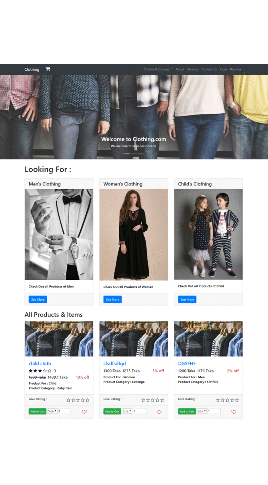
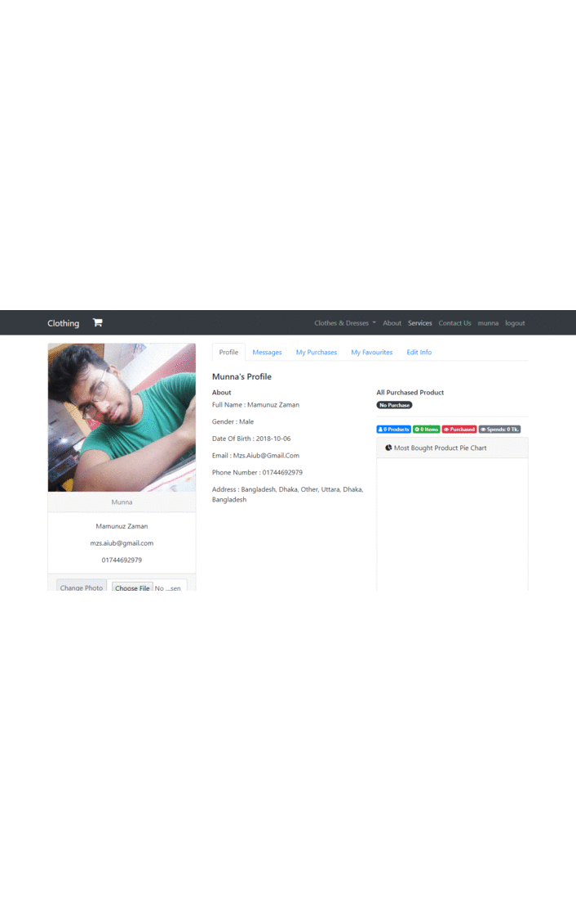
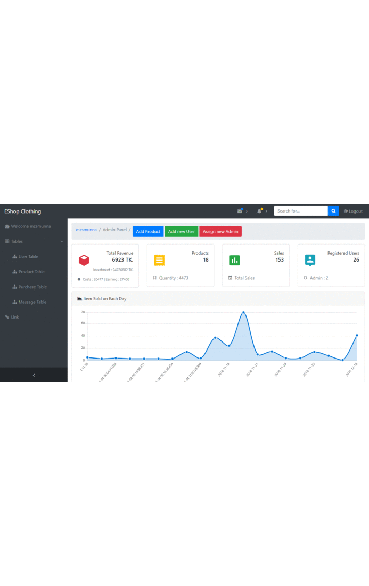

# EClothing
It's a Ecommerce Website. It's has been build using Laravel Framework along with basic PHP, JavaScript, Ajax, Bootstrap. MVC Pattern has been folloewd. It has two Panel. One for customer and another for Customer. 

Customer can search product, purchase, can add product to favorite list,  give rating, comment, reply to other's comment, can report to other's comment as well, can send message &amp; chat with admin. Also can view purchase history , stats also can view logs of what the customer is doing inside the system. 

There is Dashboard for Admin where admin can add , update , search and delete product. can see a graphical the business growth and other different stats based on purchase and selling.  gets notification on every purchase, also get notified on report of a comment. if a product gets out of stock then admin gets notified as well.

This was 1st build with Node.js in my ATP3(Advanced Topics in Programming 3) during Mid Term project submission and has been improved including a lot of features in this Laravel build during the Final Term.

To run this on your Desktop you need Laravel as the Laravel's vendor folder is missing in this repository. Download Laravel using composer and create a project then extract & replace all the files and folder from the clone zip to that project directory you have created. Make sure Xampp and PHPMyAdmin is running on your Computer. import clothing.sql database in PHPMyAdmin and then run the project.

# Demo Data

most of the product data is literelly messy. has no meaningful product name, no matching catagory and so on. I will suggest to delete all the data of all tables except user & migration table and start using the app from scratch.

admin username : mzsmunna, password : 12345

custome username : mzs, password : 123

# Demo View

